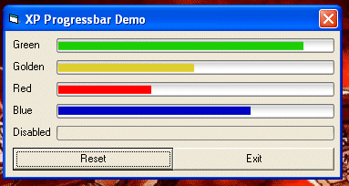



## XP Progressbar

### Description

...got bored with the windows ugly blue progressbar..here's the solution..XP Progressbar!

..cute like the ProgreessBar in XP..five colors!...This is a user control so you don't have to add any component to your project.
 
### More Info
 

             |
---                |---
**Submitted On**   |2002-11-14 04:21:04
**By**             |[Kundan](https://github.com/Planet-Source-Code/PSCIndex/blob/master/ByAuthor/kundan.md)
**Level**          |Intermediate
**User Rating**    |4.1 (29 globes from 7 users)
**Compatibility**  |VB 5\.0, VB 6\.0
**Category**       |[Complete Applications](https://github.com/Planet-Source-Code/PSCIndex/blob/master/ByCategory/complete-applications__1-27.md)
**World**          |[Visual Basic](https://github.com/Planet-Source-Code/PSCIndex/blob/master/ByWorld/visual-basic.md)
**Archive File**   |[XP\_Progres14971411142002\.zip](https://github.com/Planet-Source-Code/kundan-xp-progressbar__1-40714/archive/master.zip)

